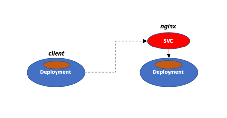
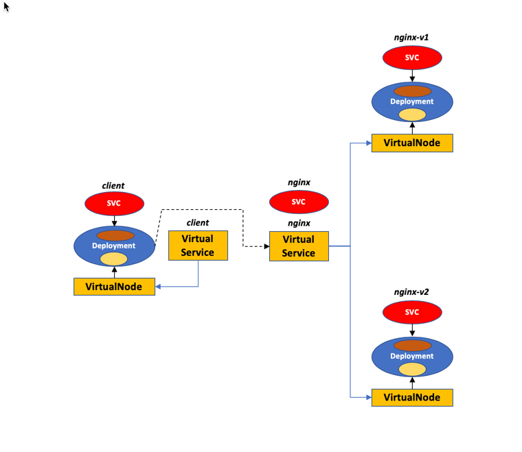

#### What is it

This is a simple App Mesh example for EKS.

#### What problem does it solve?

The whole purpose of this App Mesh example is to facilitate the job of the developer that is adding App Mesh support to her/his own application. By looking into the yaml file provided, a user should have a proper understanding of what App Mesh specific constructs she/he has to add to her/his application.

#### How is this example different from other example?

Simplicity and separation of duties.

- First it takes the most simplistic example of two basic services (a client and a web server) talking to each others. There are other examples available but they tend to have more moving parts. This is bare bone minimum to make it easier to focus on the App Mesh add-on constructs rather than on "what the app is doing".

- The second thing is that example is generic in that you can specify both the namespace you want to deploy it into as well as the mesh name you want to use. Most other existing examples and tutorials tend to provide an end-to-end coverage from how to setup a mesh all the way to how to deploy an example app (whose YAML is often tied to the Mesh previously created). This example is intended to be used in scenarios where there is a clear demarcation line between teams that build the underlying platform (IT/DevOps) and teams that consume the platform (devs). This example asssumes an App Mesh plumbing already exists and it's been created, for example, using the [official documentation](https://docs.aws.amazon.com/app-mesh/latest/userguide/mesh-k8s-integration.html), the [EKS Workshop](https://eksworkshop.com/) or [EKStender](https://github.com/mreferre/ekstender).


#### Is there a graphical diagram that describes the layout ?

Yes, a diagram goes a long way in making sense of the need for the various App Mesh constructs required.

This diagram represents the "application architecture" without App Mesh:



This diagram represents the "application architecture" with App Mesh:



Note: Removing one of the two nginx instances would have made the example even simpler but traffic routing is one of the core components of a mesh and it ultimately lays the proper foundation for what the developer may want to achieve.

#### Requirements and prerequisites

Note that this example doesn't create a mesh. It assumes a mesh has already been created. It also assumes that there is a namespace available on the EKS cluster that has been configured to inject the envoy sidecar into pods being deployed. If you are not sure about these prerequisite refer to the [official documentation](https://docs.aws.amazon.com/app-mesh/latest/userguide/mesh-k8s-integration.html), the [EKS Workshop](https://eksworkshop.com/) or [EKStender](https://github.com/mreferre/ekstender).

#### Getting started

To deploy the example on your EKS cluster, run the script below tweaking both the `<meshname>` as well as the `<namespace>` to match your environment.

```
export MYMESH=<mymesh>

template=`cat eks-simplest-example-for-appmesh.yaml | sed -e "s/MESH_NAME/$MYMESH/g"` && echo "$template" | kubectl apply -n <mynamespace> -f -
```

Query the pods:

```
kubectl get pods -n <mynamespace>
```

Exec into the client pod:

```
kubectl exec -it <client-pod> -n <mynamespace> /bin/bash
```

At this point if you `curl nginx` continuously you should see the mesh spreading traffic among the two nginx pods (which represents the two application versions). Note that the load is spread evenly because in the YAML we have given both VirtualNodes the same weight. As a side note, [this is the custom nginx image](https://github.com/mreferre/nginx-custom-site) I am using to tweak the `index.html` file.

You can use this loop to do that:

```
while true; do curl nginx; sleep 2; done
```

This is the demo end to end in action:

```
sh-4.2# export MYMESH=ekstender-mesh

sh-4.2# template=`cat eks-simplest-example-for-appmesh.yaml | sed -e "s/MESH_NAME/$MYMESH/g"` && echo "$template" | kubectl apply -n default -f -
virtualnode.appmesh.k8s.aws/nginx-v1 created
virtualnode.appmesh.k8s.aws/nginx-v2 created
virtualnode.appmesh.k8s.aws/client created
virtualservice.appmesh.k8s.aws/nginx created
virtualservice.appmesh.k8s.aws/client created
service/nginx created
service/nginx-v1 created
service/nginx-v2 created
deployment.extensions/nginx-v1 created
deployment.extensions/nginx-v2 created
deployment.extensions/client created

sh-4.2# kubectl get pods -n default
NAME READY STATUS RESTARTS AGE
client-8cfc47f86-m7g2z 2/2 Running 0 2m11s
nginx-v1-795b7c6565-fcllh 2/2 Running 0 2m11s
nginx-v2-67c6db67b6-7prlr 2/2 Running 0 2m11s

sh-4.2# kubectl exec -it client-8cfc47f86-m7g2z -n default -c client /bin/bash
bash-4.2#

bash-4.2# while true; do curl nginx; sleep 2; done
This is nginx-v2
This is nginx-v2
This is nginx-v1
This is nginx-v2
This is nginx-v1
This is nginx-v1
This is nginx-v1
This is nginx-v2
This is nginx-v1
This is nginx-v2
This is nginx-v2
This is nginx-v1
This is nginx-v2
This is nginx-v1
This is nginx-v2
This is nginx-v2
This is nginx-v1
This is nginx-v1
This is nginx-v1
This is nginx-v2
^C
bash-4.2#
```